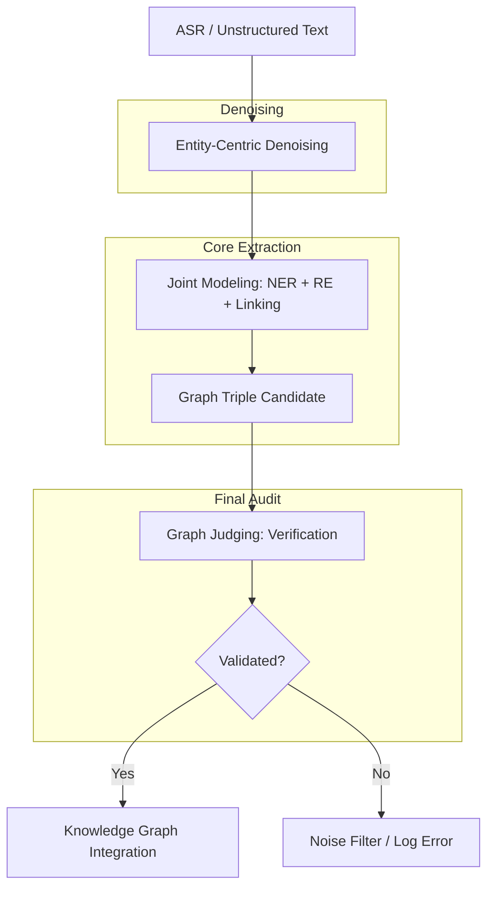

# Knowledge Graph Construction Workflow: NER → RE → KG

This document outlines a standardized pipeline for transforming unstructured text into a structured Knowledge Graph, incorporating the insights from the analyzed papers (REXEL and Graph Judge).

## 1. The Nuanced Robust Pipeline (Optimized for Noise)

A modern, robust KG pipeline moves away from simple sequential steps to a recursive, context-aware architecture designed to survive real-world data noise (ASR/OCR).

### Phase 1: Entity-Centric Denoising
*   **The Goal**: Clean the input specifically for Knowledge Graph tasks.
*   **Action**: Instead of generic spellcheck, use the surrounding context to correct phonetic errors. (e.g., Transforming the ASR *"High-der-a-bad"* into the entity *"Hyderabad"* based on its role in the sentence).

### Phase 2: Joint Modeling (NER + RE + Linking)
Following the **REXEL** architecture, this phase handles three tasks in a single pass:
1.  **NER**: Finding the "Actors" (Entities).
2.  **Relation Extraction (RE)**: Finding the "Links" (Predicates).
3.  **Entity Linking**: Mapping actors to a unique ID (Master Data).
*   **Advantage**: If the model identifies a "Person" entity, it increases the probability of identifying the correct "noisy" predicate nearby (e.g., recognizing *"is see oh of"* as *"is_CEO_of"* because a Person and Organization are linked).

### Phase 3: Graph Judging (The Final Audit)
As introduced in the **2411.17388v4** paper, every proposed triple is audited by a **Graph Judge**.
*   **Action**: An LLM compares the raw noisy text with the extracted triple.
*   **Outcome**: It acts as a safety gate, ensuring that no "junk" or hallucinated data enters the Knowledge Graph. It asks: *"Is this fact explicitly supported by the evidence, even considering the noise?"*

---

---

## 2. Benefits for Downstream Tasks

Knowledge Graphs act as a "Structured Brain" for AI systems. Here is how they enhance downstream applications:

### A. Retrieval Augmented Generation (RAG → GraphRAG)
*   **Standard RAG**: Retrieves chunks of text based on keyword/vector similarity.
*   **KG Benefit**: KGs provide **multi-hop connectivity**. If a user asks "Who is the CEO of the company that makes the iPhone?", a KG can traverse `(iPhone) -[made_by]-> (Apple) -[has_CEO]-> (Tim Cook)` to provide a precise answer that vector search might miss.

### B. Explainability & Trust
*   **Context**: Deep Learning models are often "black boxes."
*   **KG Benefit**: Decisions can be traced back to specific graph paths. Providing a "Relational Path" alongside an answer significantly increases user trust and allows for easier auditing.

### C. Data Integrity & Domain Logic
*   **Challenge**: LLMs often hallucinate facts or contradict themselves.
*   **KG Benefit**: A KG enforces **schema constraints**. You can define rules (e.g., "A person can only be a CEO of an Organization") to prevent the model from generating nonsensical data.

### D. Recommendation Systems
*   **Granularity**: Beyond "Customers who bought X also bought Y."
*   **KG Benefit**: KGs allow for **semantic similarity**. A system can recommend items based on shared properties (e.g., "This movie shares the same director, genre, and aesthetic era as your favorites") tracked within the graph.

---

## 3. Pipeline Robustness: Handling Noisy Input (ASR/OCR)

Real-world Knowledge Graph construction often fails when faced with "noisy" data, such as Automatic Speech Recognition (ASR) transcripts or poor OCR. Robustness is critical to prevent the graph from becoming a collection of "junk" nodes and edges.

### A. Nature of Noise in KGC
*   **Phonetic Substitutions**: Words that sound similar but change meaning (e.g., *"New Delhi"* transcribed as *"Knew Deli"*).
*   **Missing Punctuation**: Lack of boundaries causes the NER and RE models to lose track of sentence context.
*   **Semantic Drifts**: Missing or mistranscribed small words (prepositions/conjunctions) that reverse or alter relations.

### B. Strategies for Ensuring Robustness
*   **Entity-Centric Denoising**: Implementing a pre-processing layer that uses context to correct phonetic errors before they reach the NER stage.
*   **Joint Modeling**: Using unified architectures (like **REXEL**) where NER and RE inform each other. If a model identifies an entity as a "Person," it can more accurately "infer" the correct identity of a noisy word in the relationship path.
*   **Synthetic Noise Training**: Training models on datasets where ASR-style noise is intentionally introduced. This teaches the pipeline to interpret phonetically similar "noisy" spans as their original corrected entities.
*   **Knowledge-Aware Verification**: Using the **Graph Judge** to check if a noisy text segment actually supports a proposed triple, acting as a final filter for graph integrity.

---

## 4. Recommended Technology Stack

| Stage | Recommended Tools |
| :--- | :--- |
| **Pipeline Core** | LlamaIndex / LangGraph |
| **NER & RE** | GLiNER (Zero-shot) / Spacy / Custom Fine-tuned LLM |
| **Database** | Neo4j (Graph) / Milvus (Vector) |
| **Refinement** | GPT-4o or Claude 3.5 Sonnet (as Graph Judge) |
